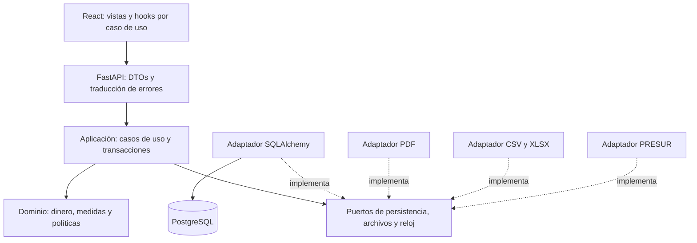

# Evolución y preservación del sistema

Propuesta vinculada a [AUDITORIA.md](AUDITORIA.md). Ninguna migración, política
de borrado, infraestructura de backup o arquitectura de esta guía se aplicó
automáticamente en esta entrega.

## Arquitectura recomendada

Un monolito modular permite conservar transacciones locales y desplegar una API.
Separar módulos de catálogo, precios/importación, carteles y caja, con límites
internos explícitos. No hay evidencia de volumen/equipos independientes que
justifique hoy el costo operativo de microservicios.



Estructura orientativa, a crear por extracciones pequeñas:

```text
backend/app/
  domain/             money, measurement, price_policy, label_content
  application/        create_product, change_price, import_catalog, confirm_batch
  ports/              product_store, unit_of_work, clock, artifact_store
  infrastructure/     sqlalchemy, csv_xlsx, reportlab, presur
  api/                rutas y DTOs
  main.py             construcción de dependencias
src/
  features/catalog/   lista, filtros, selección, formulario
  features/prices/    edición masiva y vista previa
  features/labels/    generación, descarga y confirmación
  shared/api/         transporte y errores tipados
  shared/domain/      dinero y contratos
```

No crear todas esas carpetas vacías ni interfaces por cada clase. Extraer primero
`change_price` y `import_catalog`, donde hoy se duplican revisión, historial e
invalidación de etiquetas. Separar reglas de lectura y escritura sin exigir dos
bases ni un sistema CQRS distribuido.

### Responsabilidades y SOLID

| Principio | Aplicación concreta | Límite a evitar |
| --- | --- | --- |
| SRP | Router traduce HTTP; caso de uso coordina; dominio decide; adaptador persiste/renderiza | Llamar servicio a otro archivo que siga mezclando todas esas tareas |
| OCP | Nuevos lectores de archivo y exportadores implementan puertos existentes | Jerarquías para sólo reemplazar un `if` sencillo |
| LSP | Cualquier repositorio cumple la misma semántica de ausencia, conflicto y atomicidad | Usar SQLite como prueba de que PostgreSQL tiene iguales bloqueos |
| ISP | Puertos pequeños de consulta, escritura y artefactos según consumidor | Un repositorio genérico con todos los métodos del sistema |
| DIP | Aplicación recibe puertos; infraestructura depende del dominio | Importar ReportLab desde reglas de estado del cartel |

`label_state` importa hoy `VISIBLE_LABEL_FIELDS` desde `label_pdf`: mover esa
definición al dominio, porque es el dominio quien define cuándo el cartel cambia.
Los DTOs específicos y callbacks favorecen separación, pero por sí solos no
demuestran cumplimiento de todos los principios SOLID.

Patrones útiles:

- **Application Service / Command:** un caso de uso por operación de negocio.
- **Unit of Work:** producto, historial y versión se confirman una sola vez.
  La Session ya aporta esta capacidad; envolverla sólo para expresar el contrato.
- **Repository específico:** consultas y bloqueos del catálogo aislados del HTTP;
  no recrear una abstracción completa sobre cada operación de SQLAlchemy.
- **Adapter:** pandas, ReportLab y PRESUR traducen datos en las fronteras.
- **Value Object:** precio y medida con invariantes y precisión explícitos.
- **State Machine:** transiciones válidas de lotes generados, fallidos y confirmados.
- **Outbox:** sólo si se agregan jobs/eventos externos que deban sobrevivir un
  commit; guardar el trabajo pendiente junto al snapshot y procesarlo con reintento.

Para concurrencia, elegir una estrategia consistente. Puede mantenerse bloqueo
pesimista más revisión del cliente, o usar UPDATE condicional y contadores de
versión. `version_id_col` de SQLAlchemy cubre escrituras del flush ORM, no toda
operación SQL masiva ni sustituye la revisión que recibió el usuario.
[Referencia SQLAlchemy 2.0](https://docs.sqlalchemy.org/en/20/orm/versioning.html).

### Comparación de alternativas

| Alternativa | Beneficio | Costo/riesgo | Decisión propuesta |
| --- | --- | --- | --- |
| Mejorar las capas actuales | Menor cambio y entrega rápida | Routers siguen creciendo si no se fijan límites | Primer paso |
| Monolito modular con puertos | Aísla reglas, facilita tests y adaptadores | Exige contratos y disciplina de dependencias | Destino recomendado |
| Worker de importación/PDF | Aísla tareas largas y permite reintentos | Cola durable, idempotencia, observabilidad y operación extra | Incorporar con evidencia de carga |
| Microservicios | Despliegue/escalado independiente por equipo | Transacciones distribuidas y más puntos de fallo | No justificado por evidencia actual |
| Event sourcing completo | Reconstrucción desde eventos | Migración, proyecciones, compatibilidad y tooling complejos | Mantener estado actual + auditoría transaccional |

## Plan incremental con criterios de salida

| Etapa | Trabajo | Condición para avanzar |
| --- | --- | --- |
| 0: recuperación y acceso | Inventariar exposición, respaldos, roles y restauración | Copia recuperable y permisos acordes al uso |
| 1: integridad | A02, A03, A08, A09; contrato de barcode y medida | Regresiones HTTP y DB de cada caso límite |
| 2: concurrencia | A04 y A07; semántica de archivado y confirmación | Pruebas con dos conexiones PostgreSQL sin pérdida de datos |
| 3: esquema y casos de uso | Alembic, usuario runtime, extracción de cambios de precio | Mismo contrato público, una transacción por comando |
| 4: rendimiento | Paginación real, cancelación de lecturas, planes SQL, lotes limitados | Métricas antes/después con el mismo dataset |
| 5: experiencia y despliegue | Estados UI, foco, PWA, CI y releases | Flujo real en navegador y actualización offline probados |

Cada etapa debe ser un conjunto pequeño de PRs revisables. Antes de activar una
restricción en datos existentes: consultar violaciones, generar reporte, corregir
con decisión del operador, migrar y validar. No normalizar ni descartar registros
silenciosamente para lograr que una migración pase.

## Preservación de información

### Objetivos a acordar

Definir RPO (cantidad máxima de información que puede perderse) y RTO (tiempo
máximo para volver a operar). Como punto de partida para discutir con el negocio:
RPO de 15 minutos y RTO de 2 horas; son objetivos propuestos, no garantías medidas.
Un dump nocturno por sí solo no satisface ese RPO.

### Procedimiento de respaldo propuesto

1. Backup lógico consistente de PostgreSQL con `pg_dump` en formato custom,
   incluyendo catálogo, historial, lotes y estado de secuencias. Guardar roles y
   configuración por separado, con secretos protegidos.
2. Copia cifrada fuera del equipo y del volumen Docker. Mantener una copia con
   retención/inmutabilidad independiente de las credenciales del servidor.
3. Si se acuerda RPO corto, backup base y archivado continuo WAL con monitoreo
   de fallos y retraso; verificar una recuperación a un instante anterior.
4. Retención inicial propuesta: diarios por 30 días, semanales por 12 semanas
   y mensuales por 12 meses, ajustada a espacio y necesidad del negocio.
5. Registrar fecha, tamaño, checksum, resultado y antigüedad de la última copia.
   Alertar por fallo, copia vacía y ausencia de ejecución; no sólo por salida cero.

Los dumps son snapshots consistentes y se restauran con las herramientas de
PostgreSQL; backups físicos más WAL habilitan PITR. Elegir según objetivos y
practicar ambos procedimientos que se decida mantener.
[Dumps](https://www.postgresql.org/docs/17/backup-dump.html),
[archivado continuo](https://www.postgresql.org/docs/17/continuous-archiving.html).

### Simulacro de restauración

Mensualmente y antes de cambios de esquema significativos:

1. Crear PostgreSQL aislado con versión compatible. Nunca restaurar el ensayo
   sobre la base del negocio ni usar comandos de limpieza contra ella.
2. Restaurar backup y, si corresponde, recuperar hasta el instante objetivo.
3. Comparar conteos y huellas de catálogo, historial y snapshots, además de
   constraints, índices y secuencias. Sumas de precios solas no detectan
   alteraciones compensatorias entre productos.
4. Iniciar la versión de aplicación compatible, consultar productos, generar
   y reimprimir un lote conocido y exportar PRESUR. Verificar centavos exactos.
5. Medir tiempo total y pérdida efectiva de datos; registrar evidencia, responsable
   y acciones correctivas. Un backup no está verificado hasta restaurarlo.

Para una eliminación accidental puntual, restaurar a una base auxiliar y recuperar
los registros elegidos con auditoría. Reemplazar toda la base por una copia vieja
puede perder modificaciones legítimas posteriores.

## Preservación del código y releases

- Fuente de verdad en Git con remoto y revisiones revisables; proteger rama
  principal y crear tags de releases junto con revisión de esquema.
- Conservar artefactos de release, lockfiles, versión de runtime, instrucciones
  de reconstrucción y checksums. No usar `.pyc` ni ZIP manual como única copia.
- Automatizar CI en checkout limpio: dependencias runtime/dev, tests backend,
  PostgreSQL de integración, frontend, lint y build. Declarar pytest y cliente
  HTTP de pruebas, que no aparecen en los requisitos actuales.
- Ejecutar análisis de dependencias y secretos en CI; actualizar por PR, con
  resultados de tests y compatibilidad de migración. No hay dictamen de CVEs
  en esta auditoría.
- Escribir ADRs breves para decisiones duraderas: barcode, redondeo, precio de
  caja, importación, borrado, PLU y estado de impresión. Mantener invariantes
  en README y pruebas, evitando narraciones SOLID que no reflejen la realidad.
- No retirar un campo mientras siga leyéndolo una versión desplegada. Usar
  expandir/migrar/contraer. Revertir aplicación sólo cuando sea compatible con
  el esquema; un downgrade destructivo no reemplaza la recuperación de datos.

## Medición de rendimiento

Usar datasets sintéticos de 1.000, 20.000 y 100.000 productos para consultas;
la exportación mantiene su límite específico de 20.000 productos. Medir:

| Flujo | Evidencia | Cambio a comparar |
| --- | --- | --- |
| Lista/búsqueda | Requests, bytes, p50/p95, plan SQL, buffers | Página remota, orden remoto y trigramas si aportan |
| Importación | Filas/s, RSS, duración de transacción y esperas | Parser incremental/staging y límites |
| Carteles | Tiempo de render, memoria, tiempo con filas bloqueadas | Snapshot corto seguido de render |
| PRESUR | Tiempo según distribución de IDs | Iterador de huecos o PLU persistido |
| UI | Perfil de React, memoria y latencia al escribir | Menos datos, cancelación y derivados acotados |

El build observado fue de aproximadamente 246 KB JS principal (79 KB gzip) y
482 KB del escáner (127 KB gzip). El escáner ya se carga con `lazy`: conservar
esa separación. El aviso de Babel se refiere a tiempo de compilación, no
demuestra un problema de rendimiento en el navegador. No se afirma mejora de
latencia sin benchmark comparativo.

## Convención de comentarios

Documentar responsabilidad y dependencias al comienzo de cada módulo, contratos
de funciones y razones de decisiones no evidentes cerca del código. Explicar
transacciones, revisiones, precisión, liberación de recursos y efectos secundarios.
Evitar comentar asignaciones obvias línea por línea, que dificultaría leer el flujo.

Comentarios describen el comportamiento vigente; propuestas viven en auditoría
o ADR. Al corregir A02/A03/etc., actualizar a la vez comentarios, pruebas y el
estado del hallazgo. En archivos JSON sin comentarios, describir configuración
en [MAPA_CODIGO.md](MAPA_CODIGO.md) y mantener el archivo válido.
